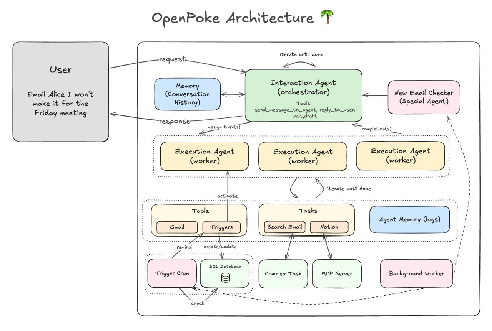
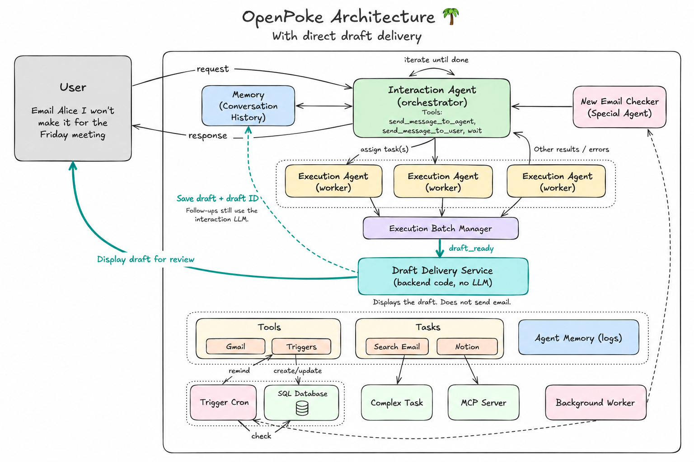

# Changes in this fork

## 1. What does “overload” mean?

I focused on overload caused by unnecessary work passing through the interaction agent’s LLM. I followed a simple principle: the interaction agent should mostly route work, while predictable, structured, or computational tasks should happen inside an execution agent or regular backend code. My goal was to remove that unnecessary work while preserving task correctness and reducing token usage.

## 2. How did I reduce it?

I targeted a narrow but common scenario: displaying completed email drafts for review. Initially, every completed draft was sent back to the interaction agent, whose LLM then called `send_draft` to display the same content to the user. This added an unnecessary LLM call and round trip.

The execution agent now returns a `draft_ready` result, and a backend **Draft Delivery Service** displays the draft directly. The service still saves the draft and its ID in the interaction agent’s conversation history, so follow-up questions, revisions, and approvals continue to work. Displaying a draft does **not** send the email. Removing this round trip saves time and model cost, which can add up quickly for a frequently used workflow like email.

## 3. How did I measure improvement?

I measured the interaction agent’s workload using:

1. triggers/turns and LLM calls -- how many times the interaction agent was trigged/invoked and how many times it;s LLM was called
2. Input/output tokens -- that passes to and fro from the interaction agent LLM
3. Task outcomes -- some automated checks, some manual checks

Lower values indicate less interaction-agent work, as long as task completion and quality remain the same because one can always lower the LLM calls or workload at the expense of reduction in quality/user experience.

I created a [reproducible benchmark of 55 user tasks](benchmarks/results/interaction_llm_calls/comparison-2026-09-19.md) to measure this. It switches direct draft delivery on or off.

Using Gemini 2.5 Flash across 55 user tasks, direct delivery (my approach) reduced interaction LLM calls from **123 to 102 (17.1%)** and triggers from **99 to 88 (11.1%)**. Both runs recorded **36 passes, 18 failures, and 1 unclear task**. See the [comparison and reproduction steps](benchmarks/results/interaction_llm_calls/comparison-2026-09-19.md).

## Before

Completed drafts return to the interaction LLM before being shown to the user.

## With direct draft delivery

The teal path shows the new backend service displaying drafts and saving their context. Other results requiring LLM's subjective analysis still go through the interaction agent.

## Other questions and notes

### When is a draft displayed directly to the user?

The **Execution Batch Manager** makes this decision after all execution agents in the current batch finish. It displays a draft directly only when `draft_ready` is enabled and Gmail has successfully created a stored draft with a draft ID, recipient, subject, and body. The backend validates those fields. Failed or incomplete results, unknown result types, and other work that needs judgment go to the interaction agent.

I also tried structuring other information passed between agents, but email drafts produced the clearest and most consistent improvement.

### Other approaches I explored

#### Execution-agent roster shortlisting

I also tested [execution-agent roster shortlisting](https://github.com/greninja/openpoke/tree/feature/roster-shortlisting). Instead of giving the interaction LLM the full agent roster on every turn, this approach provides a shortlist of recently used agents, agents matching the current message, and agents returning results during that turn. The interaction agent can still request the full roster. The [original OpenPoke write-up](https://www.shloked.com/openpoke) also proposed this idea.

In one paired Gemini 2.5 Flash Lite run, shortlisting reduced recorded tokens from **1,305,202 to 978,450**, about **25%**.

But the write-up for that experiment isn't as detailed as this (email draft) one, partly because I was running into more issues than it solved. For e.g., in one of the runs, it created more agents and had worse automated correctness results. This showed that smaller prompts can reduce workload, but routing quality must be protected too.

#### Other options considered

I also considered splitting the interaction agent into specialized sub-agents and adding a shared queue or concurrency limit. I did not pursue these options because they add coordination issues which might have been a bit messy to deal with in short time.

#### Other notes

I also stumbled on a few bugs in the agent loops: they continued running after successful delegation or waiting, repeated identical tool actions within a turn, failed to recognize some tool errors, and sometimes accepted a model’s description of a tool call without the call actually being made. I fixed these issues as part of the implementation.
